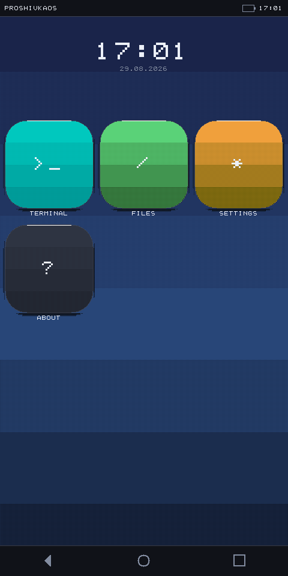
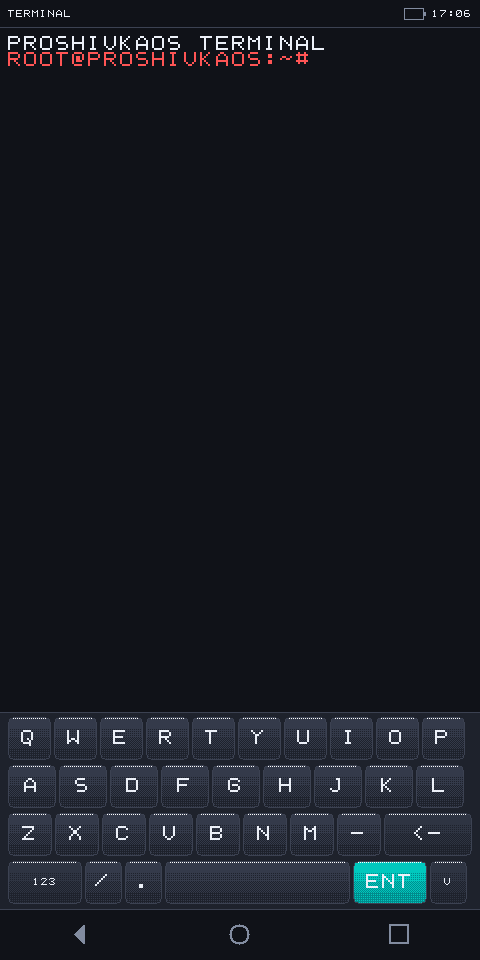
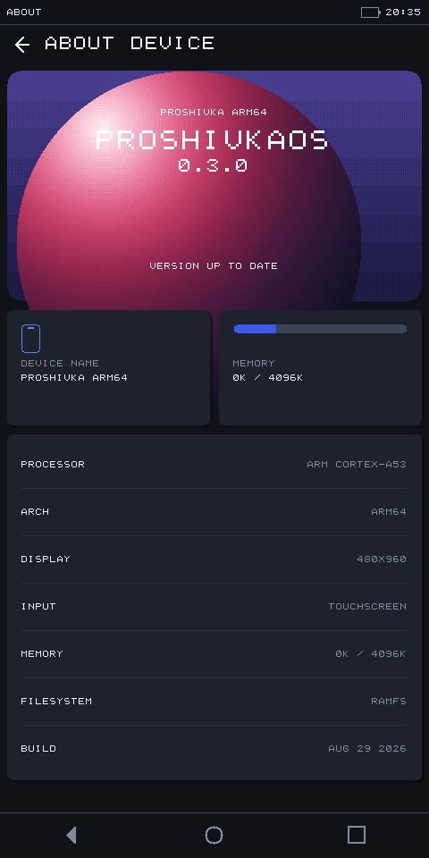
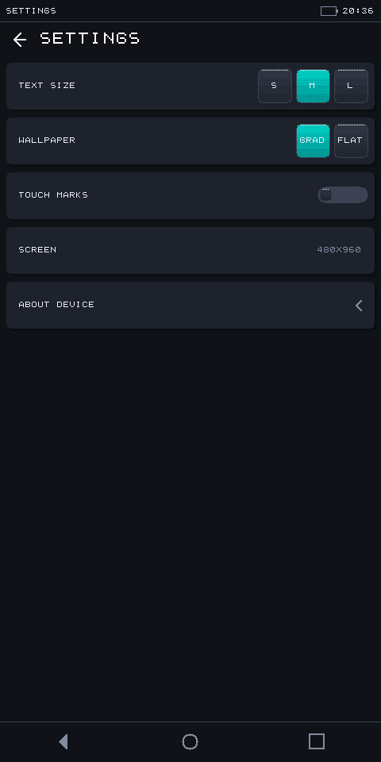
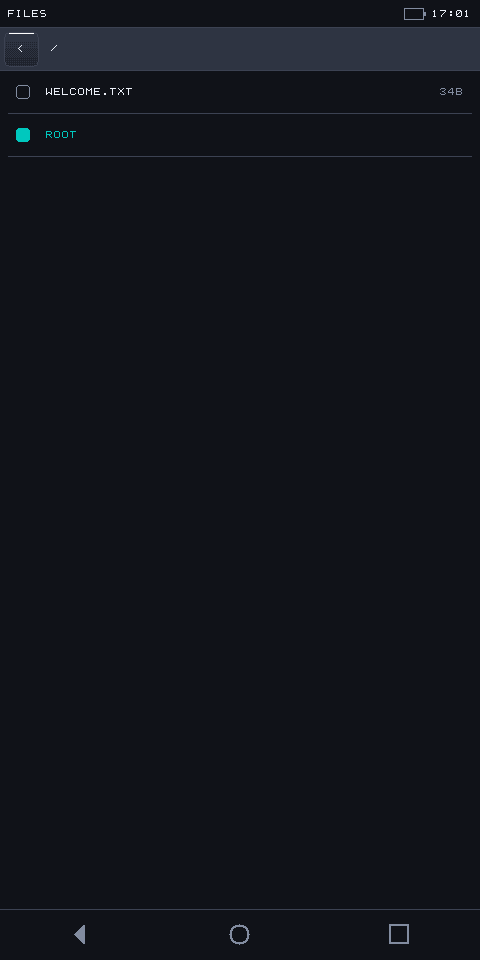
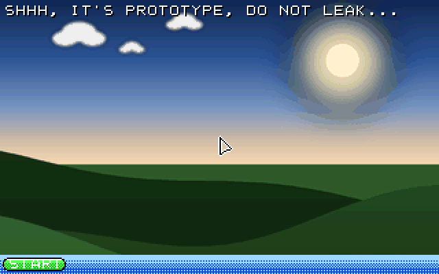

# proshivkaOS NEXT

Операционная система с нуля: собственное ядро, своя графика, свой интерфейс.
Никакой libc, никакого чужого кода — только компилятор и голое железо.

Собирается под **две архитектуры** в **три профиля**:

|            | `ARCH=x86`                    | `ARCH=arm64`                       |
|------------|-------------------------------|------------------------------------|
| **text**   | текстовый shell в VGA         | текстовый shell через UART         |
| **gui**    | оконный интерфейс в духе XP   | —                                  |
| **touch**  | тач-интерфейс, мышь за палец  | тач-интерфейс, настоящий тачскрин  |

<p align="center">
  
  
  
</p>

## Быстрый старт

```bash
# x86: нужны nasm и кросс-тулчейн i686-elf-* (Homebrew) или i386-elf-* (MacPorts)
make run                  # текстовый shell
make gui-run              # оконный интерфейс
make touch-run            # тач-интерфейс, мышь работает вместо пальца

# ARM64: brew install aarch64-elf-gcc
make ARCH=arm64 run       # текстовый shell через последовательный порт
make ARCH=arm64 touch-run # тач-интерфейс: экран, тачскрин, клавиатура
make ARCH=arm64 bootimg   # Android boot.img для fastboot
make help                 # все цели
```

Разрешение экрана тач-сборки задаётся при сборке:

```bash
make ARCH=arm64 touch SCREEN_W=720 SCREEN_H=1440
```

## Устройство

Всё держится на одном правиле: **ни один файл вне `arch/` не содержит
`#ifdef` по архитектуре**. Ядро, файловая система, shell и почти вся графика
написаны один раз и не знают, где исполняются. Выбор платформы делает
Makefile, подставляя в сборку нужный файл-бэкенд.

```
      приложения  ──►  hal_* (консоль, память, время, ввод, графика)
                            │
                ┌───────────┴───────────┐
          arch/x86/                arch/arm64/
      VGA, PS/2, VBE,          PL011, ramfb, virtio-input,
      CMOS RTC, PIT            MMU, ARM Generic Timer
```

Благодаря этому ARM64-порт не потребовал ни одной правки в `kernel/`, `fs/`,
`shell/` и `apps/` — подробности в [docs/ARM64_PLAN.md](docs/ARM64_PLAN.md).

Тач-оболочка устроена как в postmarketOS с Phosh: ядро и приложения остаются
обычными, вся «телефонность» живёт отдельным слоем в `gui/touch/`. Терминал
на телефоне — тот же самый файл, что работает в десктопной сборке; ему
поменяли только область вывода и масштаб шрифта.

| Документ | О чём |
|---|---|
| [docs/ARCHITECTURE.md](docs/ARCHITECTURE.md) | слои, дерево каталогов, что уже есть и чего нет |
| [docs/ARM64_PLAN.md](docs/ARM64_PLAN.md)     | как устроен ARM64-порт и что нужно для конкретного телефона |
| [docs/TOUCH_UI.md](docs/TOUCH_UI.md)         | почему десктопный интерфейс нельзя просто уменьшить |
| [docs/FLASHING.md](docs/FLASHING.md)         | сборка `boot.img`, Redmi Note 4 и Pixel 6a |

## Несколько решений, которые стоит пояснить

**Рисование идёт индексами палитры даже там, где у железа честный
32-битный цвет.** Благодаря этому интерфейс, написанный под VGA mode13h с
её 256 цветами, работает на телефоне без единой правки; преобразование
индекс → RGB делается один раз за кадр при выводе. Полупрозрачности на
индексной палитре нет, поэтому тени и градиенты набираются дизерингом —
техника интерфейсов конца девяностых, здесь она пришлась ровно к месту.

**MMU на ARM64 включён не ради виртуальной памяти, а ради кэшей.** При
выключенном MMU архитектура обязывает считать всю память некэшируемой, и
отрисовка кадра тормозит на порядок. Плата — явное обслуживание
когерентности с устройствами, которые читают ОЗУ мимо кэша процессора.

**Размеры тач-интерфейса считаются от разрешения экрана, а базовая единица —
не пиксель, а минимальная тач-цель.** Экран телефона бывает любым, а палец у
пользователя во всех случаях одинаковый. Поэтому одна и та же сборка
корректно раскладывается и на 480x960, и на 720x1440.

**Срабатывание по отпусканию, а не по нажатию.** Палец закрывает то, во что
тыкает, и возможность отвести его в сторону и передумать — не мелочь, а
основа ощущения от сенсорного интерфейса.

## Чего пока нет

Честный список: прерываний (ни IDT/PIC на x86, ни GIC на ARM64 — всё
опрашивается в цикле), вытесняющего планировщика, изоляции процессов,
освобождения памяти, постоянного хранилища (RamFS живёт до перезагрузки) и
разбора device tree на ARM64.

Последнее — главное препятствие для запуска на настоящем телефоне: адреса
периферии пока зашиты под машину QEMU virt. Что именно и в каком порядке
нужно сделать, расписано в [docs/FLASHING.md](docs/FLASHING.md), раздел 5.

## Скриншоты

<p align="center">
  
  
</p>

Десктопная сборка на x86 — она никуда не делась и работает как раньше:

<p align="center">
  
</p>
